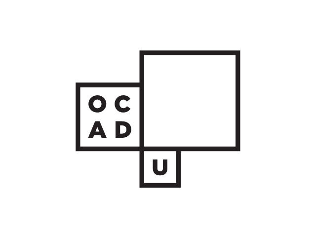

# Web Systems Design
### DIGF 6039 - Digital Futures

Keywords: *digital architecture, design systems, markdown, interactive notebooks, html5, pure css, motion graphics, git, open source, es6, webgl, svg, creative coding.*

[Syllabus](https://ocadu-web.github.io/syllabus.pdf)

